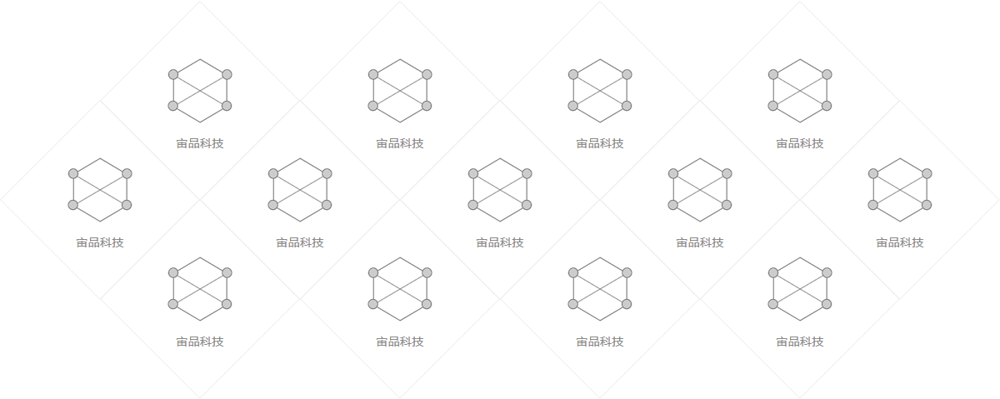

# vvdw

一个美观的菱形网状列表组。一般可用来放置客户ICON列表



## CSS Classes

* `.vvdw`  主类
* `.vvdw-row`  行容器
* `.vvdw-item`  子项
* `.vvdw-border`  菱形背景
* `.vvdw-icon`  图标
* `.vvdw-text`  说明文字


## 结构层次

```
div.vvdw
    ul.vvdw-row
        li.vvdw-item
            div.vvdw-border
            img.vvdw-icon
            div.vvdw-text
```

## 订制

可以用 vvdw_size.scss 订制大小。